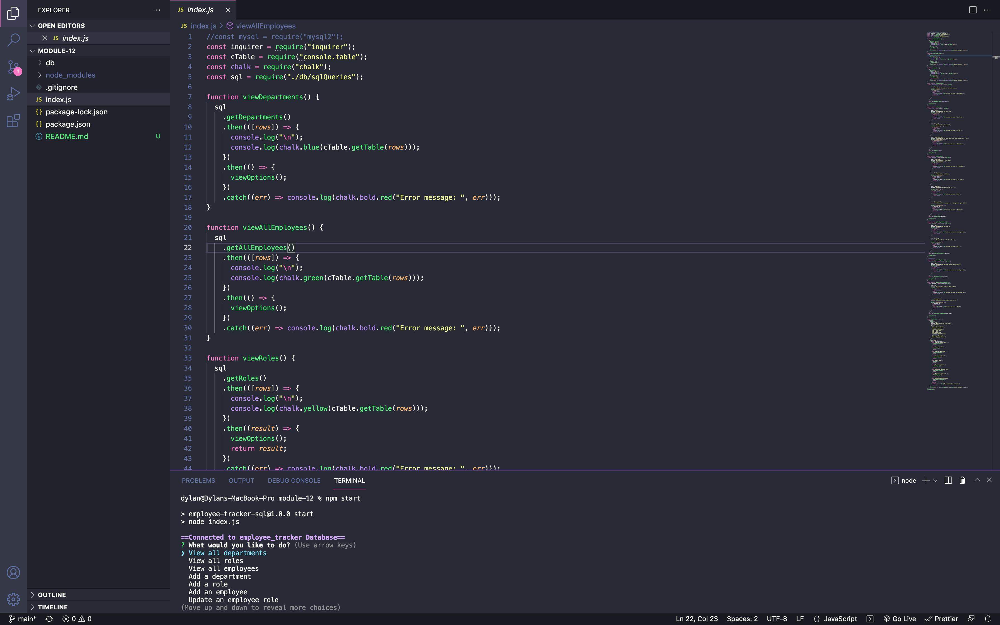

# Employee Tracker
  ## Table of Contents
  * [Project Description](#project-description)
  * [Installation](#installation)
  * [Usage](#usage)
  * [License](#license)
  * [Contributing](#contributing)
  * [Demo Video](#Project-Demo-Video)
  * [Questions?](#questions)
  ## Project Description
  This is an employee tracker using Inquirer to get the user's input and express.js to handle routes and responses and MySQL to store the data to the database.
  ## Installation
  npm install
  ## Usage
  npm start
  ## License
  This project is under MIT for licensing.
  
  ## Contributing
  feel free to submit code
  ## Project Demo Video
  https://drive.google.com/file/d/1jE0VfeHe9xzGTBpXO9Zo1Rla7mA5V8J7/view

  
  ## Questions
  please feel free to ask me any questions.
  Github username: Dylanbitto
  Github Email: <Dylanbitto5425@gmail.com>
  
